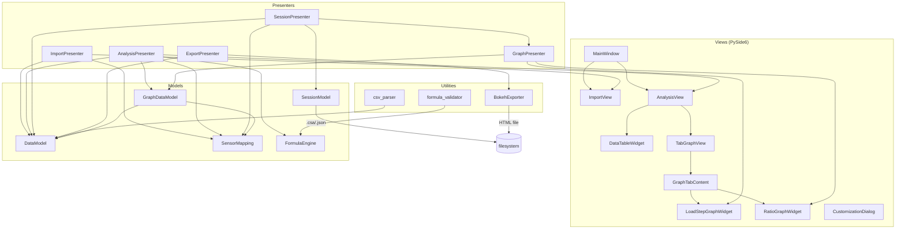
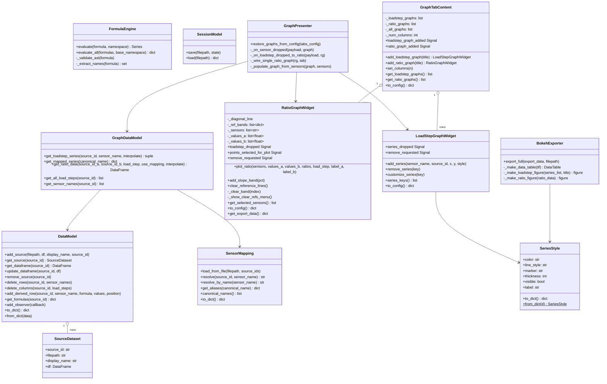
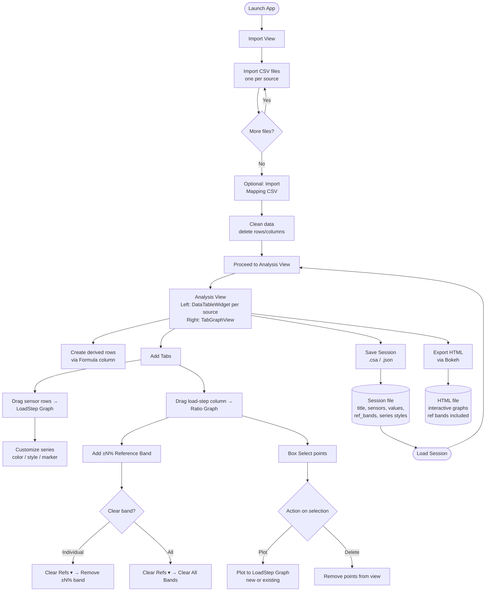

# Codebase Reference — Correlation Analysis Application

## Overview

A PySide6 desktop application for multi-source sensor strain correlation analysis.
Users import CSV files (rows = sensors, columns = load steps), clean data, define
sensor mappings and derived formulas, then visualize and compare data across sources
using interactive graphs. Sessions can be saved/loaded and exported as interactive HTML.

**Architecture:** Model-View-Presenter (MVP)
**Stack:** PySide6, pandas, pyqtgraph, bokeh, qt-material

---

## Entry Point

### `main.py`
Bootstraps the Qt application, creates all models/presenters/views, applies
`qt-material` light-blue theme, and shows the `MainWindow`.

---

## Models (`correlation_analysis/models/`)

### `data_model.py`

#### `SourceDataset` (dataclass)
Container for a single imported CSV source.
- `source_id: str` — UUID-based unique identifier assigned on import
- `filepath: str` — original file path
- `display_name: str` — basename of the file, shown in UI
- `df: pd.DataFrame` — sensor rows × load-step columns; formula metadata stored in `df.attrs["formulas"]`

#### `DataModel`
Central registry for all imported `SourceDataset` objects.

| Method | Purpose |
|--------|---------|
| `add_source(filepath, df, display_name, source_id)` | Register a new dataset; returns assigned `source_id` |
| `get_source(source_id)` | Return `SourceDataset` or `None` |
| `get_dataframe(source_id)` | Return a copy of the DataFrame |
| `update_dataframe(source_id, df)` | Replace the stored DataFrame; notifies observers |
| `remove_source(source_id)` | Delete a source; notifies observers |
| `all_sources()` | List all `SourceDataset` objects |
| `source_ids()` | List all source ID strings |
| `delete_rows(source_id, sensor_names)` | Drop sensor rows in-place; notifies |
| `delete_columns(source_id, load_steps)` | Drop load-step columns in-place; notifies |
| `add_derived_row(source_id, sensor_name, formula, values, position)` | Insert/update a formula row at `position`; stores formula in `df.attrs`; uses `np.nan` for empty cells |
| `get_formulas(source_id)` | Return `{sensor_name: formula_string}` dict |
| `set_formula(source_id, sensor_name, formula)` | Update a formula string without recomputing |
| `add_observer(callback)` | Register `callback(event, source_id)` for change notifications |
| `to_dict() / from_dict()` | JSON serialization (`orient="split"`) / deserialization with `io.StringIO` for pandas 2.x compatibility |

**Observer events:** `"added"`, `"updated"`, `"removed"`, `"loaded"`, `"formula_updated"`

**Serialization note:** `to_dict()` uses `df.to_json(orient="split")` to preserve float column dtypes.
`from_dict()` wraps the JSON string in `io.StringIO` (required since pandas 2.x treats bare strings as file paths).

---

### `sensor_mapping.py`

#### `SensorMapping`
Maps canonical sensor names (from a mapping CSV) to per-source aliases.

Internal structure: `{canonical_name: {source_col_header: sensor_name_in_source}}`

> **Important:** Mapping CSV column headers are arbitrary strings (e.g. `"Source A"`),
> NOT the UUID-based `source_id` values used by `DataModel`. Use `resolve_by_name()`
> to look up canonical names by sensor value when the source_id key doesn't match.

| Method | Purpose |
|--------|---------|
| `load_from_file(filepath, source_ids)` | Parse mapping CSV; first column = canonical names, other columns = source aliases |
| `load_from_dict(data)` | Restore from serialized dict |
| `resolve(source_id, sensor_name)` | Look up canonical name by exact source_id key (may return None if keys differ) |
| `resolve_by_name(sensor_name)` | Search all alias values; more robust fallback when source_id keys don't match |
| `get_aliases(canonical_name)` | Return `{source_col_header: sensor_name}` dict |
| `canonical_names()` | List all canonical sensor names |
| `add_mapping(canonical, source_id, sensor_name)` | Add a single entry programmatically |
| `is_empty()` | True if no mappings loaded |
| `to_dict()` | Serialize for session save |

---

### `formula_engine.py`

#### `FormulaError`
Exception raised for formula syntax or runtime errors.

#### `FormulaEngine`
AST-based safe formula evaluator. Uses Python's `ast` module to validate node types
before calling `eval()` with a restricted namespace — no raw builtins allowed.

**Allowed functions:** `abs`, `sqrt`, `sin`, `cos`, `tan`, `log`, `exp`, `min`, `max`, `round`, `sum`, `np`

| Method | Purpose |
|--------|---------|
| `evaluate(formula, namespace)` | Evaluate a formula string against `{sensor_name: pd.Series}`; returns `pd.Series` |
| `evaluate_all(formulas, base_namespace)` | Evaluate multiple formulas in topological dependency order |
| `_validate_ast(formula)` | Walk AST nodes; raise `FormulaError` on disallowed node types |
| `_extract_names(formula)` | Return all `Name` nodes referenced in a formula (for dependency graph) |

---

### `graph_data_model.py`

#### `GraphDataModel`
Transforms `DataModel` DataFrames into arrays ready for graph rendering.

| Method | Purpose |
|--------|---------|
| `get_loadstep_series(source_id, sensor_name, interpolate)` | Return `(x_array, y_array)` of load steps vs strain values |
| `get_mapped_series(canonical_name)` | Return `{source_id: (x, y)}` for all sources containing the canonical sensor |
| `get_ratio_data(source_id_a, source_id_b, load_step, use_mapping, interpolate)` | Compute `value_a / value_b` at a given load step; returns DataFrame with columns `[sensor, value_a, value_b, ratio]` |
| `get_all_load_steps(source_id)` | Return sorted list of numeric load-step column values |
| `get_sensor_names(source_id)` | Return list of sensor index values |

Ratio matching logic: when `use_mapping=True`, finds matching sensors by searching all alias values against each DataFrame's index (bypasses source_id key mismatch).

---

### `session_model.py`

#### `SessionModel`
JSON serialization of full application state.

| Method | Purpose |
|--------|---------|
| `save(filepath, state)` | Write state dict to `.csa` / `.json` with version header and timestamp |
| `load(filepath)` | Read and validate session file; raises `ValueError` on version mismatch |

Session file format: `{version, created, sources, mapping, tabs}`

---

## Views (`correlation_analysis/views/`)

### `main_window.py`

#### `MainWindow` (QMainWindow)
Application shell. Hosts a `QStackedWidget` switching between `ImportView` (index 0)
and `AnalysisView` (index 1). Provides the menu bar (File, View, Help) and status bar.

**Signals:**
- `save_session_requested(filepath: str)`
- `load_session_requested(filepath: str)`
- `export_html_requested(filepath: str)`

**Properties:** `import_view`, `analysis_view`

**Methods:** `show_view(index)`, `show_status(message, timeout)`, `show_error(message)`

---

### `import_view.py`

#### `SourceTableFrame` (QFrame)
Thin wrapper around `DataTableWidget` with a colored validation border.
- `set_valid(valid: bool)` — green (`#4CAF50`) or red (`#F44336`) border
- `data_widget()` — returns the inner `DataTableWidget`

#### `ImportView` (QWidget)
View 1: File import and data cleanup.

**Layout:** toolbar → info label → QSplitter(file list | QStackedWidget for tables)

**Signals:**
- `import_csv_requested()` — user clicked Import CSV
- `import_mapping_requested()` — user clicked Import Mapping
- `proceed_requested()` — user clicked Proceed to Analysis
- `remove_source_requested(source_id: str)` — right-click → Remove

**Key methods:**

| Method | Purpose |
|--------|---------|
| `add_source_table(source_id, df, display_name, is_valid)` | Add file to list + create `SourceTableFrame` in stack; auto-selects new entry |
| `remove_source_table(source_id)` | Remove from list + stack; shows placeholder if empty |
| `update_source_table(source_id, df)` | Refresh a table's DataFrame |
| `set_source_valid(source_id, is_valid)` | Update border color |
| `set_mapping_info(info)` | Update status label below splitter |
| `show_mapping_dialog(mapping_data)` | Modal read-only table of canonical → aliases |
| `show_error / show_warning / confirm_delete` | Standard dialogs |

**Behavior:** Only one table visible at a time; clicking a list item switches the stack.
Tables use `DataTableWidget(show_formula=False)` — no Formula column in Import view.

---

### `analysis_view.py`

#### `AnalysisView` (QWidget)
View 2: Analysis workspace.

**Layout:** QSplitter(left panel | TabGraphView)

Left panel: filter bar + scrollable container of `DataTableWidget`s (one per source)

**Signals:**
- `formula_changed(source_id, sensor_name, formula)`
- `row_delete_requested(source_id, sensors)`
- `column_delete_requested(source_id, load_steps)`
- `add_derived_row_requested(source_id, df_insert_pos: int)` — int is the DataFrame row position
- `sensor_dropped_to_graph(payload: dict, graph: LoadStepGraphWidget)`
- `filter_changed(text: str)`

**Key methods:**

| Method | Purpose |
|--------|---------|
| `add_data_table(source_id, df, formulas, derived_rows, title)` | Create and register a new `DataTableWidget` |
| `update_table(source_id, df)` | Refresh a specific table's data |
| `set_table_filter(text)` | Apply text filter to ALL tables simultaneously |
| `set_table_mapped_names(source_id, mapped)` | Set mapped-names column on a specific table |
| `get_tab_view()` | Return the `TabGraphView` |
| `get_table_widget(source_id)` | Return a specific `DataTableWidget` |
| `clear_tables()` | Remove all table widgets from the left panel (called before session load) |

---

### `data_table_widget.py`

#### `DraggableHeaderView` (QHeaderView)
Custom horizontal header that enables drag-and-drop for load-step columns.
- Mouse move > threshold on a load-step column initiates `QDrag` with `application/x-loadstep-column` MIME
- Right-click context menu: Delete column / Select column
- Calls `model.is_loadstep_col(col)` to distinguish load-step columns from Sensor/Formula/Mapped columns

#### `SensorTableModel` (QAbstractTableModel)
Wraps a pandas DataFrame. Supports optional Formula column, Mapped Names column, and text filtering.

**Column layout:**
- `show_formula=True`: `[Sensor, Formula, LS1…LSN, (Mapped Names)]`
- `show_formula=False`: `[Sensor, LS1…LSN, (Mapped Names)]`

`_ls_start` property: 2 when `show_formula=True`, 1 when `False`

**Key methods:**

| Method | Purpose |
|--------|---------|
| `set_filter(text)` | Filter rows by sensor name OR mapped names string (case-insensitive contains) |
| `set_mapped_names(mapped: dict)` | Provide `{sensor_name: "canonical \| alias"}` to show extra column |
| `is_loadstep_col(col_idx)` | True if column index falls in the load-step range |
| `add_derived_row(sensor_name, formula, position)` | Insert a derived row at `position` using `np.nan` for empty cells; clears active filter so row is immediately visible |
| `update_derived_row(sensor_name, values)` | Update displayed values for a derived row in-place |
| `mimeData(indexes)` | Produce `application/x-sensor-row` MIME JSON: **list** of `{sensor_name, source_id, is_derived, formula}` — one entry per selected row |

**Filtering:** Uses `_row_indices: list[int]` mapping visible rows to actual DataFrame rows.
`_rebuild_row_indices()` recomputes this list on each filter change.

**Row selection:** `SelectionBehavior.SelectRows` — selecting any cell highlights the full row.
`_header_selected_cols` tracks columns explicitly selected via header click, so "Delete Column"
operates only on header-selected columns and not on row selections.

#### `DataTableWidget` (QWidget)
Wraps `SensorTableModel` + `QTableView` + `DraggableHeaderView`.

**Signals:** `row_delete_requested`, `column_delete_requested`, `formula_changed`, `row_added(source_id, df_insert_pos)`

**Key methods:** `update_dataframe`, `add_derived_row(sensor_name, formula, values, position)`,
`update_derived_row`, `set_mapped_names`, `set_sensor_filter`, `get_model`, `source_id`

**Multi-row drag:** `start_row_drag()` collects all selected rows and encodes them as a JSON
list in the MIME payload. `LoadStepGraphWidget.dropEvent` iterates the list and emits
`series_dropped` once per item, so all selected sensors are plotted.

---

### `tab_graph_view.py`

#### `GraphTabContent` (QWidget)
Content of a single graph tab. Manages `LoadStepGraphWidget`s and `RatioGraphWidget`s
in a `QGridLayout` that respects a configurable column count.

**Signals:** `loadstep_graph_added(LoadStepGraphWidget)`, `ratio_graph_added(RatioGraphWidget)`

**State:**
- `_loadstep_graphs: list[LoadStepGraphWidget]`
- `_ratio_graphs: list[RatioGraphWidget]`
- `_all_graphs: list[QWidget]` — insertion-ordered list of ALL graphs (used for grid placement)
- `_num_columns: int` — current column count (default 1)

**Toolbar:** "+ LoadStep Graph", "+ Ratio Graph" buttons, and a "Columns:" `QSpinBox` (range 1–6).
Changing the spinbox instantly rearranges the grid.

| Method | Purpose |
|--------|---------|
| `add_loadstep_graph(title)` | Create graph (min height 350 px), append to lists, wire `remove_requested`, relayout, emit signal |
| `add_ratio_graph(title)` | Same as above for `RatioGraphWidget` |
| `set_columns(n)` | Set column count programmatically (clamps 1–6); syncs spinbox; calls `_relayout_graphs()` — used on session restore |
| `_relayout_graphs()` | Remove all graphs from grid, re-add at `(i // cols, i % cols)` positions |
| `_on_columns_changed(value)` | Spinbox `valueChanged` slot; updates `_num_columns` and calls `_relayout_graphs()` |
| `_remove_graph(graph)` | Remove a graph from all tracking lists and the grid, hide, and call `deleteLater()` |
| `get_loadstep_graphs()` | Return list of `LoadStepGraphWidget` |
| `get_ratio_graphs()` | Return list of `RatioGraphWidget` |
| `clear_graphs()` | Remove all graphs from grid and lists (called before session restore) |
| `to_config()` | Serialize tab config including `num_columns`, `loadstep_graphs`, `ratio_graphs` |

Default content on creation: one LoadStep graph + one Ratio graph.

#### `TabGraphView` (QWidget)
`QTabWidget`-based container for graph tabs.

**Signals:** `tab_added(tab_id: str)`, `tab_removed(tab_id: str)`

| Method | Purpose |
|--------|---------|
| `add_tab(name)` | Create a new `GraphTabContent` tab; returns it |
| `current_tab()` | Return currently active `GraphTabContent` |
| `get_tab(tab_id)` | Look up tab by ID |
| `all_tabs()` | Return list of all `GraphTabContent` |
| `get_tab_name(tab_id)` | Return current display name of a tab from the tab bar |
| `get_all_loadstep_graphs()` | Flatten all LoadStep graphs across all tabs |
| `clear_all_tabs()` | Remove all tabs and reset counter (called before session restore) |
| `to_config()` | Serialize all tabs; each entry includes `tab_name` and `num_columns` |

Double-click on tab label → rename dialog. Close button on tab (kept to minimum 1).

---

### `loadstep_graph.py`

#### `LoadStepGraphWidget` (QWidget)
pyqtgraph-based LoadStep vs Strain graph. Supports multiple series, crosshair hover,
drag-and-drop from `DataTableWidget` rows, right-click customization menu, and a
close button to remove the graph from its parent tab.

**Signals:**
- `series_dropped(payload: dict)` — row MIME dropped on widget
- `series_removed(source_id, sensor_name)`
- `remove_requested()` — emitted when user clicks the × close button

**UI:** Thin close-button header (×, top-right) + `pg.PlotWidget`. The plot is always
visible (no placeholder hint text). An empty graph shows blank axes until series are added.

**Key methods:**

| Method | Purpose |
|--------|---------|
| `add_series(sensor_name, source_id, x, y, style)` | Add or update a series with `SeriesStyle`; auto-assigns color from `_COLORS` palette |
| `remove_series(key)` | Remove a series by key (`"source_id::sensor_name"`) |
| `customize_series(key)` | Open `CustomizationDialog` to edit style, then re-add |
| `series_keys()` | List all active series keys |
| `get_series_info(key)` | Return `{item, style, sensor_name, source_id, x, y}` dict |
| `clear()` | Remove all series; re-adds crosshair overlay items |
| `get_title()` | Return graph title string |
| `to_config()` | Serialize as `{title, series: [{sensor_name, source_id, style}]}` |

**Drag-bounce fix:** `_dragging` flag + event filter on `self._plot.viewport()` blocks
all `MouseButtonPress/Release/DblClick/Move` events while a drag is in progress,
preventing pyqtgraph's scene from panning/zooming during drops.

**Hover:** `pg.SignalProxy` throttles `sigMouseMoved` to 30 fps; `_on_mouse_moved`
finds nearest x-position across all series and shows HTML tooltip via `pg.TextItem`.

---

### `ratio_graph.py`

#### `RatioGraphWidget` (QWidget)
pyqtgraph scatter graph: X = Strain from Source A, Y = Strain from Source B,
one point per sensor at a selected load step. Accepts drag-and-drop of load-step columns.

**Signals:**
- `loadstep_dropped(payload: dict)` — column MIME dropped on graph
- `points_selected_for_plot(sensors: list[str], target: str)` — box selection result
- `points_deleted(sensors: list[str])` — selection deleted
- `remove_requested()` — emitted when user clicks the × close button

**UI:** Toolbar (Box Select, + Reference Band, Clear Refs ▾, × close button) + `pg.PlotWidget`.
The plot is always visible. Default axis labels "Strain A" / "Strain B" are updated to
source-specific names when `plot_ratio()` is called. Empty graph shows blank axes.

**Reference line state:**
- `_diagonal_line` — the permanent 1:1 (Y = X) dashed grey line; added by `plot_ratio`, removed
  only when `plot_ratio` redraws. Never touched by "Clear Refs".
- `_ref_bands: list[dict]` — each entry is `{"pct": float, "lines": [pos_line, neg_line]}`.
  Populated by `add_slope_band`; cleared by `clear_reference_lines` or `_clear_band`.

**Key methods:**

| Method | Purpose |
|--------|---------|
| `plot_ratio(sensors, values_a, values_b, ratios, load_step, label_a, label_b)` | Render scatter plot with 1:1 reference line; removes old diagonal before redrawing; silently returns if no valid (non-NaN) pairs |
| `add_slope_band(pct)` | Add ±N% corridor lines around the 1:1 reference; appends `{"pct", "lines"}` to `_ref_bands` |
| `clear_reference_lines()` | Remove all band lines from `_ref_bands`; **diagonal is preserved** |
| `_clear_band(index)` | Remove a single band by index from `_ref_bands` |
| `_show_clear_refs_menu()` | Pop a `QMenu` from "Clear Refs ▾": shows "Clear All Bands" + per-band "Remove ±N% band" entries; shows disabled "No reference bands added" when empty |
| `get_selected_sensors()` | Return sensor names for currently selected points |
| `to_config()` | Return `{title, sensors, values_a, values_b, ratios, label_a, label_b, load_step, ref_bands}` or `None` if nothing plotted. `ref_bands` is `[pct, ...]` |
| `get_export_data()` | Return `{sensors, values_a, values_b, ratios, label_a, label_b, ref_bands}` or `None`. `ref_bands` is `[pct, ...]` |

**Box selection:** Toolbar "Box Select" button toggles mode. When active, disables
pyqtgraph pan/zoom; left-drag on viewport draws `QRubberBand`; on release, maps
screen rect → data coordinates via `ViewBox.mapSceneToView`; shows context menu
with options to plot or delete selected sensors.

**Drop handling:** `eventFilter` on `self._plot` and `self._plot.viewport()` catches
`DragEnter/DragMove/Drop` events for `application/x-loadstep-column` MIME.

---

### `customization_dialog.py`

#### `SeriesStyle` (dataclass)
Complete styling for one graph series: `color`, `line_style`, `marker`, `thickness`,
`visible`, `label`. Supports `to_dict()` / `from_dict()` for serialization.

#### `CustomizationDialog` (QDialog)
Modal dialog for editing `SeriesStyle`. Contains color picker (QColorDialog),
line style combo, marker combo, thickness spin box, visibility checkbox, label
input. Returns edited style via `get_style()` after `exec()`.

---

## Presenters (`correlation_analysis/presenters/`)

### `import_presenter.py`

#### `ImportPresenter`
Coordinates `ImportView` ↔ `DataModel` ↔ `SensorMapping`.

| Signal handler | Action |
|----------------|--------|
| `import_csv_requested` | Open file dialog; call `_import_single_csv` for each selection |
| `import_mapping_requested` | Open file dialog; call `mapping.load_from_file`; show mapping dialog |
| `proceed_requested` | No-op (main.py wires this to `show_view`) |
| `remove_source_requested(source_id)` | Confirm → `data_model.remove_source` + `view.remove_source_table` |

`_import_single_csv`: Parses CSV via `parse_sensor_csv`, registers in `DataModel`,
calls `view.add_source_table`, wires `row_delete_requested` / `column_delete_requested`
signals back to `DataModel` operations.

---

### `analysis_presenter.py`

#### `AnalysisPresenter`
Manages `AnalysisView` interactions. Owns `GraphPresenter`.

| Signal handler | Action |
|----------------|--------|
| `formula_changed(source_id, sensor, formula)` | Build namespace from raw rows; evaluate via `FormulaEngine`; call `data_model.add_derived_row` |
| `row_delete_requested` | Confirm dialog → `data_model.delete_rows` |
| `column_delete_requested` | Confirm dialog → `data_model.delete_columns` |
| `add_derived_row_requested(source_id, df_insert_pos)` | Input dialog for name → `data_model.add_derived_row(position=df_insert_pos)` + `widget.add_derived_row(position=df_insert_pos)` |
| `filter_changed(text)` | Broadcast to `view.set_table_filter(text)` |
| Data model observer `"updated"/"loaded"` | Call `view.update_table` |

**`initialize_from_model()`** — Called after session load or "Proceed" from import.
Iterates all sources, adds tables to view, and populates Mapped Names columns via
`_build_mapped_names`.

**`_build_mapped_names(source_id, df)`** — For each sensor, looks up canonical name
using `resolve(source_id, name) or resolve_by_name(name)`, then builds
`"canonical | alias_b | alias_c"` display string.

**Derived row position:** `add_derived_row_requested` carries an absolute DataFrame
row index (`df_insert_pos`), computed by `DataTableWidget` from the selected row's
position in `_row_indices`. Both `DataModel.add_derived_row` and
`SensorTableModel.add_derived_row` accept this position to insert at the correct location
via `pd.concat([df.iloc[:pos], new_row, df.iloc[pos:]])`.

---

### `graph_presenter.py`

#### `GraphPresenter`
Handles all graph data wiring: sensor drops, ratio drops, box-selection plotting.

**Signal wiring on init:**
- `analysis_view.sensor_dropped_to_graph` → `_on_sensor_dropped`
- All existing ratio graphs in all tabs → `_wire_single_ratio_graph`
- `tab_added` → `_wire_new_tab_ratio` for future tabs
- `ratio_graph_added` on each tab → `_wire_single_ratio_graph` for dynamically added graphs

| Handler | Action |
|---------|--------|
| `_on_sensor_dropped(payload, graph)` | Get `(x, y)` from `GraphDataModel`; `graph.add_series`; if mapping non-empty, resolve canonical and call `_offer_mapped_sensors` |
| `_offer_mapped_sensors(canonical, graph, exclude_source)` | Search all other sources for alias names; if found, QMessageBox.question → add mapped series |
| `_on_loadstep_dropped_to_ratio(payload, rg)` | Parse load step; if 1 source → info dialog; else show dialog to pick numerator/denominator sources; call `graph_data.get_ratio_data`; `rg.plot_ratio`. The `rg` argument is the specific `RatioGraphWidget` that received the drop — passed via lambda in `_wire_single_ratio_graph` to support multiple ratio graphs per tab |
| `_on_selected_to_graph(sensors, tab)` | If no existing LoadStep graphs → create one; else show dialog listing existing graphs; call `_populate_graph_from_sensors` |
| `_populate_graph_from_sensors(graph, sensors)` | For each source × each canonical sensor, try direct name then aliases; add first match as series |

**Multi-ratio-graph drop fix:** `_wire_single_ratio_graph` connects `loadstep_dropped`
using `lambda payload, r=rg: self._on_loadstep_dropped_to_ratio(payload, r)` — each ratio
graph captures its own reference `r`, so the correct graph receives the data regardless of
how many ratio graphs exist in the tab.

**`restore_graphs_from_config(tabs_config)`** — Clears all tabs; recreates each tab with
its saved name and column count (`tab.set_columns`); restores LoadStep series by re-fetching
`(x, y)` from `GraphDataModel`; restores Ratio graphs by replaying `plot_ratio` with saved
values, then calls `rg.add_slope_band(pct)` for each entry in the saved `ref_bands` list.

---

### `session_presenter.py`

#### `SessionPresenter`
Coordinates save and load of application state.

**`save_session(filepath)`** — Collects `data_model.to_dict()`, `mapping.to_dict()`,
`tab_view.to_config()` into a state dict; calls `SessionModel.save`.

**`load_session(filepath)`** — Calls `SessionModel.load`; clears stale view state with
`analysis_view.clear_tables()`; restores `DataModel` and `SensorMapping`;
calls `analysis_presenter.initialize_from_model()`; then
`graph_presenter.restore_graphs_from_config(state["tabs"])`; switches to analysis view.

---

### `export_presenter.py`

#### `ExportPresenter`
Coordinates HTML export via Bokeh.

**`export_html(filepath)`** — Collects:
1. All `DataModel` sources → `{name, df}` list
2. All analysis tabs with display names, `num_columns`, LoadStep series data, and Ratio graph data
   → structured `export_data` dict
3. Calls `BokehExporter.export_full(export_data, filepath)`

Data collected per LoadStep graph: title + list of series `{sensor_name, source_id, x, y, style}`.
Data collected per Ratio graph: calls `rg.get_export_data()` (returns `None` if not yet plotted).
`num_columns` is read directly from `tab_content._num_columns`.

---

## Utilities (`correlation_analysis/utils/`)

### `csv_parser.py`

#### `CSVParseError`
Exception for unrecoverable CSV parse failures.

#### `CSVValidationResult` (dataclass)
`is_valid: bool`, `errors: list[str]`, `warnings: list[str]`

#### `parse_sensor_csv(filepath) -> (DataFrame, CSVValidationResult)`
Reads CSV with `index_col=0`; coerces column headers to float (load steps); checks
for duplicate sensor names (warning) and non-numeric cell values (error). Returns
cleaned DataFrame with `Sensor` index name.

#### `parse_mapping_csv(filepath) -> DataFrame`
Simple `pd.read_csv(index_col=0)` for mapping files.

---

### `formula_validator.py`

#### `ValidationResult` (dataclass)
`is_valid`, `error_message`, `referenced_sensors`

#### `FormulaValidator`
Pre-execution AST-based formula validator (separate from `FormulaEngine`).
Checks node types and function names against allowed sets.
`validate(formula)` — returns `ValidationResult` with list of referenced sensor names.

---

### `bokeh_exporter.py`

#### `BokehExporter`
Generates a single interactive HTML file from the full application state.

**`export_full(export_data, filepath)`** — Main entry point.

`export_data` structure:
```python
{
  "sources": [{"name": str, "df": pd.DataFrame}, ...],
  "tabs": [{
    "name": str,
    "num_columns": int,          # matches app's column layout
    "loadstep_graphs": [{"title": str, "series": [...]}],
    "ratio_graphs": [{"sensors", "values_a", "values_b", "ratios", "label_a", "label_b", "ref_bands"} | None]
  }]
}
```

HTML structure (top → bottom, `sizing_mode="stretch_width"` throughout):
- **"Data Tables"** heading + `Tabs` — one tab per source, each containing a `DataTable`
- **"Analysis Graphs"** heading + `Tabs` — one tab per analysis tab, each containing a `gridplot`

**Column layout in export:** Each analysis tab uses Bokeh `gridplot(rows, sizing_mode="stretch_width")`
where `rows` is a list-of-lists matching the app's `num_columns` setting. If the last row is
short, it is padded with `None` so column widths stay uniform. Empty ratio graphs (no data)
render as a titled placeholder figure rather than being omitted.

**`_make_data_table(df)`** — Bokeh `DataTable` from a DataFrame; numeric column keys
prefixed with `col_` to avoid ColumnDataSource issues with numeric field names.

**`_make_loadstep_figure(series_list, title)`** — Bokeh line figure with `HoverTool`,
legend with `click_policy="hide"`, support for line dash patterns and markers.
Returns an empty figure if `series_list` is empty.

**`_make_ratio_figure(ratio_data)`** — Bokeh scatter figure with 1:1 dashed grey reference
line, `HoverTool` showing sensor name and both strain values, and optional ±N% corridor bands.
Reads `ratio_data["ref_bands"]` (list of pct floats) and draws two dashed orange lines per
band at `y = x * (1 ± pct/100)`. The `+pct%` line carries a legend label; the `-pct%` line
is unlabelled to avoid duplicate legend entries.

**`export(graph_data, filepath)`** — Legacy method (LoadStep series only, kept for compatibility).

---

## MIME Types

| MIME type | Source | Target | Payload |
|-----------|--------|--------|---------|
| `application/x-sensor-row` | `SensorTableModel.mimeData` row drag | `LoadStepGraphWidget.dropEvent` | JSON **list** of `{sensor_name, source_id, is_derived, formula}` — one entry per selected row |
| `application/x-loadstep-column` | `DraggableHeaderView.mouseMoveEvent` | `RatioGraphWidget.eventFilter` Drop | `{load_step, source_id}` |

---

## Data Flow Summary

```
CSV files
    │  parse_sensor_csv()
    ▼
DataModel  ←──────────────────── SensorMapping (mapping CSV)
    │  get_loadstep_series()          │ resolve_by_name()
    ▼                                 │
GraphDataModel  ──────────────────────┘
    │  (x, y) arrays / ratio DataFrames
    ▼
LoadStepGraphWidget / RatioGraphWidget
    │  to_config() / get_export_data()
    ▼
SessionModel (save/load)
BokehExporter (HTML export)
```

---

## Key Design Decisions

1. **source_id vs mapping keys**: `DataModel` uses short UUID strings as source IDs.
   Mapping CSVs use arbitrary column headers. These never match, so `resolve_by_name()`
   searches alias *values* instead of keys — used everywhere canonical lookup is needed.

2. **FormulaEngine uses AST eval**: Raw `eval()` with `{"__builtins__": {}}` and a
   whitelist of math functions. AST validation runs first to reject forbidden node types.

3. **DataModel uses plain callbacks, not Qt signals**: Keeps models Qt-free and
   independently testable. Presenters register callbacks; views are never directly observed.

4. **Drag bounce prevention**: `LoadStepGraphWidget` installs an event filter on
   `self._plot.viewport()` to block all mouse events while `_dragging=True`, preventing
   pyqtgraph's scene from intercepting drag motion as pan/zoom.

5. **Mapped Names column**: Appended after load steps in `SensorTableModel` when
   `set_mapped_names()` is called. Text filter checks this column alongside sensor name,
   enabling filtering by canonical or alias names across all sources simultaneously.

6. **`show_formula` param**: `DataTableWidget` and `SensorTableModel` accept
   `show_formula=False` to hide the Formula column in the Import view, where formulas
   are not applicable.

7. **Grid layout per tab**: Each `GraphTabContent` uses a `QGridLayout` (`_graph_layout`)
   inside a `QScrollArea`. The column count is controlled by a spinbox and stored in
   `_num_columns`. `_all_graphs` tracks insertion order across both graph types so
   `_relayout_graphs()` can reposition everything consistently when the column count changes.

8. **Per-graph delete**: Both graph widgets expose `remove_requested = Signal()` triggered
   by a × close button. `GraphTabContent._remove_graph()` handles removal from all
   tracking structures and the grid layout, then calls `deleteLater()`.

9. **Multiple ratio graphs and drag-and-drop**: Each ratio graph's `loadstep_dropped`
   signal is connected via a lambda that captures its specific widget reference:
   `lambda payload, r=rg: handler(payload, r)`. This ensures drops are routed to the
   correct graph regardless of how many ratio graphs exist in the tab.

10. **pandas 2.x serialization**: `df.to_json(orient="split")` preserves float column
    dtypes. `pd.read_json(io.StringIO(raw), orient="split")` is required because pandas 2.x
    treats a bare JSON string argument as a file path. All derived rows use `np.nan`
    (not `pd.NA`) to remain compatible with numpy float operations in graph code.

11. **Ratio graph reference line separation**: `_diagonal_line` stores the single 1:1 line
    added by `plot_ratio` and is never cleared by user action. `_ref_bands` stores user-added
    corridor bands as `{"pct", "lines"}` dicts. This split means "Clear Refs" (and session
    restore) can operate on bands independently of the always-present diagonal. Both `to_config`
    and `get_export_data` serialise `ref_bands` as a plain `[pct, ...]` list so session save,
    JSON export, and Bokeh HTML export all reproduce the corridors faithfully.

---

## Diagrams

### Architecture Diagram



---

### Class Diagram



---

### User Workflow Flowchart



---

## Tests (`correlation_analysis/tests/`)

**Total: 154 tests across 5 modules.** Run with:
```
/c/Users/Arjun/.conda/envs/valifem/python.exe -m pytest correlation_analysis/tests/ -v
```

All tests are pure unit tests (no live Qt event loop required except widget tests, which use the
session-scoped `qapp` fixture) and complete in under 2 seconds.

---

### `conftest.py` — Shared Fixtures

| Fixture | Scope | Description |
|---------|-------|-------------|
| `qapp` | session | Creates or reuses a single `QApplication` for the entire test session. Required by any test that instantiates a Qt widget. |
| `sample_df` | function | 3-sensor × 3-loadstep `DataFrame` (`SensorA/B/C` × `1.0/2.0/3.0`). Used across multiple test modules. |
| `ratio_inputs` | function | Parallel lists `(sensors, values_a, values_b, ratios)` with 3 sensors at slightly different values, suitable for `RatioGraphWidget.plot_ratio`. |

---

### `test_models.py` — Model Unit Tests (61 tests)

#### DataModel — basic

| Test | What it verifies |
|------|-----------------|
| `test_data_model_add_source` | `add_source` returns a valid `source_id` and `get_dataframe` returns the correct index |
| `test_data_model_delete_rows` | `delete_rows` removes the named sensor from the stored DataFrame |
| `test_data_model_delete_columns` | `delete_columns` drops the specified load-step column |
| `test_data_model_observer` | Observer callback receives the `"added"` event after `add_source` |

#### DataModel — extended

| Test | What it verifies |
|------|-----------------|
| `test_data_model_update_dataframe_fires_updated` | `update_dataframe` notifies observers with `"updated"` |
| `test_data_model_update_unknown_source_noop` | `update_dataframe` on a non-existent source does not raise |
| `test_data_model_clear_fires_cleared` | `clear` empties all sources and fires `"cleared"` event |
| `test_data_model_all_sources` | `all_sources` returns a list containing the correct `SourceDataset` |
| `test_data_model_get_source_unknown_returns_none` | `get_source("bad_id")` returns `None` |
| `test_data_model_remove_fires_removed` | `remove_source` fires `"removed"` event |
| `test_data_model_multiple_observers` | Both registered observers receive the same event |
| `test_data_model_display_name_defaults_to_basename` | When `display_name` is omitted, `os.path.basename(filepath)` is used |
| `test_data_model_delete_rows_notifies` | `delete_rows` fires `"updated"` |
| `test_data_model_delete_columns_notifies` | `delete_columns` fires `"updated"` |
| `test_data_model_get_dataframe_returns_copy` | Mutating the returned DataFrame does not affect the stored copy |

#### FormulaEngine — basic

| Test | What it verifies |
|------|-----------------|
| `test_formula_engine_basic` | `(SensorA + SensorB) / 2` produces the correct mean Series |
| `test_formula_engine_invalid` | `import os` raises `FormulaError` (disallowed AST node) |
| `test_formula_engine_circular` | Circular dependency between two formulas raises `FormulaError` |

#### FormulaEngine — extended

| Test | What it verifies |
|------|-----------------|
| `test_formula_engine_abs` | `abs(S)` correctly handles negative Series values |
| `test_formula_engine_sqrt` | `np.sqrt(S)` computes element-wise square root via the `np` namespace |
| `test_formula_engine_division_by_zero` | `1 / 0` raises `FormulaError` with "Division by zero" |
| `test_formula_engine_unknown_name` | Referencing an unknown sensor raises `FormulaError` with "Unknown sensor" |
| `test_formula_engine_syntax_error` | Malformed formula raises `FormulaError` with "Syntax" |
| `test_formula_engine_scalar_result_broadcasts` | A bare scalar (e.g. `42`) is broadcast to a Series with the same index length as the namespace |
| `test_formula_engine_power_operator` | `S ** 2` computes element-wise squaring |
| `test_formula_engine_evaluate_all_dependency_order` | `evaluate_all` with `B = Base * 2`, `C = B + 1` resolves in the correct topological order |
| `test_formula_engine_evaluate_all_independent_formulas` | Independent formulas `Mem` and `Bend` both evaluate correctly in a single `evaluate_all` call |

#### GraphDataModel

| Test | What it verifies |
|------|-----------------|
| `test_graph_data_model_series` | `get_loadstep_series` returns correct `(x, y)` arrays |
| `test_graph_data_model_missing_source_raises` | `ValueError` raised when `source_id` is not registered |
| `test_graph_data_model_missing_sensor_raises` | `ValueError` raised when sensor name is not in the DataFrame index |
| `test_graph_data_model_get_all_load_steps` | Returns the correct sorted list of numeric load-step columns |
| `test_graph_data_model_get_all_load_steps_missing_source` | Returns `[]` for an unknown source |
| `test_graph_data_model_get_sensor_names` | Returns the correct set of sensor index names |
| `test_graph_data_model_ratio_no_mapping` | `get_ratio_data` with `use_mapping=False` produces one row per common sensor |
| `test_graph_data_model_ratio_values_correct` | `value_a`, `value_b`, and `ratio` fields are numerically correct |
| `test_graph_data_model_ratio_missing_load_step_no_interp` | All ratios are NaN when the requested load step is absent and `interpolate=False` |
| `test_graph_data_model_ratio_interpolation` | `value_a` and `value_b` are linearly interpolated for a load step between two known columns |
| `test_graph_data_model_ratio_with_mapping` | With a populated `SensorMapping`, only the mapped canonical sensor appears in the result |
| `test_graph_data_model_ratio_invalid_source_raises` | `ValueError` raised when both source IDs are invalid |
| `test_graph_data_model_get_mapped_series` | `get_mapped_series` returns `(x, y)` for each source that has the canonical sensor |
| `test_graph_data_model_loadstep_series_with_interpolation` | A NaN gap in the middle of a series is filled by linear interpolation when `interpolate=True` |

#### SensorMapping

| Test | What it verifies |
|------|-----------------|
| `test_sensor_mapping` | `add_mapping` + `resolve` + `get_aliases` round-trip |
| `test_sensor_mapping_resolve_by_name` | `resolve_by_name` searches alias values across all canonicals |
| `test_sensor_mapping_clear` | `clear` resets all mappings; `is_empty()` and `canonical_names()` reflect the empty state |
| `test_missing_analysis_no_issues` | No unmapped or incomplete entries when mapping is complete |
| `test_missing_analysis_unmapped_sensors` | Sensors in imported data not in mapping appear in `unmapped` |
| `test_missing_analysis_incomplete_canonicals` | Canonicals missing an alias for some source appear in `incomplete` |
| `test_missing_analysis_empty_mapping` | All imported sensors reported as unmapped when no mapping is loaded |
| `test_missing_analysis_empty_sources` | `unmapped` is empty when no imported sources are passed |

#### Logging

| Test | What it verifies |
|------|-----------------|
| `test_logging_config` | `setup_logging` attaches a `RotatingFileHandler` to the root logger and accepts log writes |

---

### `test_csv_parser.py` — CSV Parsing Tests (34 tests)

#### TestParseSensorCsvHappy

| Test | What it verifies |
|------|-----------------|
| `test_returns_tuple` | `parse_sensor_csv` returns `(DataFrame, CSVValidationResult)` |
| `test_valid_csv_is_valid` | A well-formed CSV has `is_valid=True` and no errors |
| `test_shape_matches_raw` | DataFrame shape is (rows × cols) matching the raw CSV cell count |
| `test_integer_index_and_columns` | Raw DataFrame has 0-based integer index and column labels |
| `test_float_load_steps_accepted` | Floating-point values in the header row (e.g. `1.5`) are accepted |

#### TestParseSensorCsvErrors

| Test | What it verifies |
|------|-----------------|
| `test_missing_file_raises` | Non-existent path raises `CSVParseError` |
| `test_empty_file_raises` | Empty file raises `CSVParseError` |
| `test_single_row_raises` | File with only one row raises `CSVParseError` (no data rows) |
| `test_single_column_raises` | File with only one column raises `CSVParseError` (no load steps) |
| `test_non_numeric_load_step_gives_error` | Non-numeric value in the header row is reported as an error |
| `test_non_numeric_data_cell_gives_error` | Non-numeric value in a data cell is reported as an error |
| `test_empty_load_step_gives_error` | Empty cell in the header row is reported as an error |

#### TestParseSensorCsvWarnings

| Test | What it verifies |
|------|-----------------|
| `test_duplicate_sensor_warning` | Repeated sensor name in column 0 produces a `warnings` entry |
| `test_empty_sensor_name_warning` | Empty cell in the sensor name column produces a `warnings` entry |
| `test_no_warnings_for_clean_csv` | A clean CSV produces zero warnings |

#### TestValidateRawDataframe

| Test | What it verifies |
|------|-----------------|
| `test_valid_raw_df_returns_true` | A properly structured raw DataFrame passes validation |
| `test_too_few_rows_returns_false` | Single-row DataFrame fails |
| `test_too_few_columns_returns_false` | Single-column DataFrame fails |
| `test_non_numeric_header_returns_false` | Non-numeric value in row-0 load-step header fails |
| `test_non_numeric_data_returns_false` | Non-numeric value in data section fails |
| `test_empty_header_cell_returns_false` | Empty cell in header row fails |

#### TestFinalizeDataframe

| Test | What it verifies |
|------|-----------------|
| `test_returns_dataframe` | `finalize_dataframe` returns a `pd.DataFrame` |
| `test_index_is_sensor_names` | The index contains the sensor names from column 0 (rows 1+) |
| `test_columns_are_float_load_steps` | Columns are float-coerced from the header row |
| `test_values_are_numeric` | All value columns have numeric dtype |
| `test_values_correct` | Specific cell values match the source CSV |
| `test_too_few_rows_raises` | DataFrame with fewer than 2 rows raises `CSVParseError` |
| `test_non_numeric_values_become_nan` | Non-numeric data cells are coerced to `NaN` via `pd.to_numeric(errors="coerce")` |

---

### `test_views.py` — View Widget Tests (60 tests)

#### TestParseSensorGroup

| Test | What it verifies |
|------|-----------------|
| `test_valid_11_char_name_returns_5_char_key` | A valid 11-char name returns a non-None 5-char group key |
| `test_group_key_composition` | `F06L01NI01L` → key `"FLNIL"` (Element + L/R + N/P + Location + Direction) |
| `test_wrong_length_returns_none` | 10-char and 12-char names return `None` |
| `test_invalid_element_char_returns_none` | Position 0 not in `_ELEMENT_CHARS` returns `None` |
| `test_invalid_lr_char_returns_none` | Position 3 not in `{L, R}` returns `None` |
| `test_invalid_np_char_returns_none` | Position 6 not in `{N, P}` returns `None` |
| `test_invalid_location_char_returns_none` | Position 7 not in `{I, O, W, F, H}` returns `None` |
| `test_non_digit_frame_number_returns_none` | Non-digit characters at positions 1–2 return `None` |
| `test_non_digit_stringer_returns_none` | Non-digit characters at positions 4–5 return `None` |
| `test_two_different_valid_names_same_group` | Two names that differ only in counter digits produce the same group key |

#### TestRatioGraphWidgetInit

| Test | What it verifies |
|------|-----------------|
| `test_ref_bands_empty_on_creation` | `_ref_bands` is `[]` before any plotting |
| `test_diagonal_line_none_on_creation` | `_diagonal_line` is `None` before any plotting |
| `test_to_config_returns_none_before_plot` | `to_config()` returns `None` when no data has been plotted |
| `test_get_export_data_returns_none_before_plot` | `get_export_data()` returns `None` when no data has been plotted |

#### TestRatioGraphWidgetAfterPlot

| Test | What it verifies |
|------|-----------------|
| `test_diagonal_set_after_plot` | `_diagonal_line` is set after `plot_ratio` |
| `test_ref_bands_still_empty_after_plot` | `_ref_bands` remains `[]` immediately after `plot_ratio` (no auto-bands) |
| `test_to_config_has_empty_ref_bands` | `to_config()["ref_bands"]` is `[]` when no bands have been added |
| `test_get_export_data_has_empty_ref_bands` | `get_export_data()["ref_bands"]` is `[]` when no bands have been added |
| `test_to_config_preserves_core_fields` | `sensors`, `values_a`, `values_b`, `load_step`, `label_a`, `label_b` all round-trip through `to_config` |

#### TestAddSlopeBand

| Test | What it verifies |
|------|-----------------|
| `test_add_one_band_updates_ref_bands` | After `add_slope_band(10.0)`, `_ref_bands` has one entry with `pct == 10.0` |
| `test_add_band_stores_two_lines` | Each band entry contains exactly two pyqtgraph line items (positive and negative corridors) |
| `test_add_multiple_bands` | Two consecutive `add_slope_band` calls produce two entries in correct order |
| `test_to_config_serialises_ref_bands` | `to_config()["ref_bands"]` returns `[10.0, 50.0]` after adding both bands |
| `test_get_export_data_serialises_ref_bands` | `get_export_data()["ref_bands"]` reflects the current band list |
| `test_add_band_without_plot_does_nothing` | Calling `add_slope_band` before any `plot_ratio` leaves `_ref_bands == []` |

#### TestClearReferenceLines

| Test | What it verifies |
|------|-----------------|
| `test_clear_removes_all_bands` | `clear_reference_lines` removes all entries from `_ref_bands` |
| `test_clear_preserves_diagonal` | `_diagonal_line` is unchanged after `clear_reference_lines` |
| `test_clear_on_empty_bands_is_safe` | Calling `clear_reference_lines` when no bands exist does not raise |

#### TestClearBand

| Test | What it verifies |
|------|-----------------|
| `test_clear_band_removes_correct_entry` | `_clear_band(0)` removes only the first band; the second band remains with its original `pct` |
| `test_clear_band_last_entry` | `_clear_band(1)` removes the second band; the first band remains |
| `test_clear_band_invalid_index_is_safe` | An out-of-range positive index (e.g. 99) does not raise |
| `test_clear_band_negative_index_is_safe` | A negative index (e.g. -1) does not raise |

#### TestReplot

| Test | What it verifies |
|------|-----------------|
| `test_diagonal_replaced_on_replot` | Calling `plot_ratio` twice creates a new `_diagonal_line` object (the old one is removed) |
| `test_bands_cleared_on_replot` | Pre-existing bands are cleared when `plot_ratio` is called again |
| `test_config_round_trip_with_bands` | Bands saved via `to_config` can be re-applied to a fresh widget to reconstruct identical band state |

#### TestRatioGraphWidgetMeta

| Test | What it verifies |
|------|-----------------|
| `test_title_stored` | Constructor `title` argument is stored in `_title` |
| `test_default_labels_before_plot` | `_label_a` and `_label_b` default to `"Source A"` / `"Source B"` |
| `test_labels_set_after_plot` | `plot_ratio` updates `_label_a` and `_label_b` to the provided arguments |
| `test_load_step_stored` | `plot_ratio` stores the `load_step` argument in `_load_step` |
| `test_sensors_stored` | `plot_ratio` stores the sensors list in `_sensors` |

#### TestGetSelectedSensors

| Test | What it verifies |
|------|-----------------|
| `test_empty_before_plot` | `get_selected_sensors()` returns `[]` on a fresh widget |
| `test_empty_after_plot_with_no_selection` | `get_selected_sensors()` returns `[]` after plotting with no box selection active |

#### TestAllNaNPlot

| Test | What it verifies |
|------|-----------------|
| `test_all_nan_values_a_leaves_no_scatter` | When all `values_a` are NaN, no valid pairs exist, `plot_ratio` returns early, and `_diagonal_line` stays `None` |
| `test_to_config_still_none_after_no_valid_plot` | `to_config()` remains `None` because `_sensors` was never populated by a successful plot |

---

### `test_presenters.py` — Presenter / Session Tests (13 tests)

#### TestSessionConfigRoundTrip

Tests the contract between `RatioGraphWidget.to_config()` and the `GraphPresenter.restore_graphs_from_config`
replay path (`plot_ratio` → `add_slope_band` per saved `pct`).

| Test | What it verifies |
|------|-----------------|
| `test_config_with_no_bands_round_trips` | A widget with no bands saves `ref_bands=[]` and restores with `_ref_bands == []` |
| `test_config_with_one_band_round_trips` | A single `10.0%` band survives save → restore |
| `test_config_with_multiple_bands_round_trips` | `[10.0, 50.0]` band list is fully preserved through the round-trip |
| `test_old_config_without_ref_bands_key_is_safe` | Configs saved before `ref_bands` was added (no key) load without error when the restore path uses `.get("ref_bands", [])` |
| `test_export_data_ref_bands_matches_config` | `get_export_data()["ref_bands"]` and `to_config()["ref_bands"]` are identical for the same widget state |

#### TestImportPresenterSmoke

| Test | What it verifies |
|------|-----------------|
| `test_data_model_add_and_remove` | `add_source` → `remove_source` cycle correctly updates `source_ids()` |
| `test_session_model_save_load` | A state dict containing `ref_bands: [10.0, 50.0]` in a ratio graph config survives a full `save` → `load` round-trip via `SessionModel` |
| `test_session_model_old_format_no_ref_bands` | A session file without `ref_bands` key in a ratio graph config loads without error; `.get("ref_bands", [])` returns `[]` |

---

### `test_bokeh_exporter.py` — Bokeh HTML Export Tests (46 tests)

#### TestMakeRatioFigureNoBands

| Test | What it verifies |
|------|-----------------|
| `test_returns_figure` | `_make_ratio_figure` returns a non-None Bokeh figure |
| `test_only_diagonal_line_present` | With no `ref_bands`, exactly 1 line renderer (the 1:1 diagonal) exists |
| `test_diagonal_legend_label` | The single line renderer is present (legend entry exists) |
| `test_missing_ref_bands_key_is_safe` | `ratio_data` without the `ref_bands` key does not raise; falls back to `[]` via `.get` |

#### TestMakeRatioFigureWithBands

| Test | What it verifies |
|------|-----------------|
| `test_one_band_adds_two_extra_lines` | One band adds 2 lines (±N%) for a total of 3 (1 diagonal + 2 band) |
| `test_two_bands_add_four_extra_lines` | Two bands add 4 lines for a total of 5 |
| `test_band_line_color_is_orange` | Band lines use the orange `#F57F17` colour |
| `test_band_line_is_dashed` | Band lines have a non-solid dash pattern |
| `test_empty_ref_bands_list_gives_only_diagonal` | `ref_bands=[]` results in exactly 1 line |
| `test_no_valid_data_returns_placeholder` | All-NaN `values_a`/`values_b` returns a placeholder figure without raising |

#### TestMakeRatioFigureLegend

| Test | What it verifies |
|------|-----------------|
| `test_positive_band_has_legend_label` | The positive band line carries a legend label containing the percentage |

#### TestMakeLoadstepFigure

| Test | What it verifies |
|------|-----------------|
| `test_returns_figure` | `_make_loadstep_figure` returns a non-None Bokeh figure |
| `test_title_set` | The figure's `title.text` matches the provided title string |
| `test_empty_series_list_returns_figure` | An empty series list produces a valid (empty) figure |
| `test_one_line_per_series` | Two series produce exactly 2 line renderers |
| `test_legend_created_with_label` | The legend contains a label matching the series sensor name |
| `test_line_color_matches_style` | `style["color"]` is applied as the line's `line_color` |
| `test_dashed_line_style` | `style["line_style"] = "Dashed"` produces a non-solid Bokeh dash pattern |
| `test_scatter_added_when_marker_set` | `style["marker"] = "Circle"` causes a scatter renderer to be added |
| `test_no_scatter_when_marker_none` | `style["marker"] = "None"` results in zero scatter renderers |

#### TestExportFull

| Test | What it verifies |
|------|-----------------|
| `test_export_creates_html_file` | `export_full` creates a file at the specified path |
| `test_html_file_contains_bokeh_root` | The output file is valid HTML (contains `<html`) |
| `test_export_empty_data_no_error` | Exporting with no sources and no tabs completes without raising |
| `test_export_ratio_graph_no_sensors` | A ratio graph entry with no sensor data renders a placeholder without raising |
